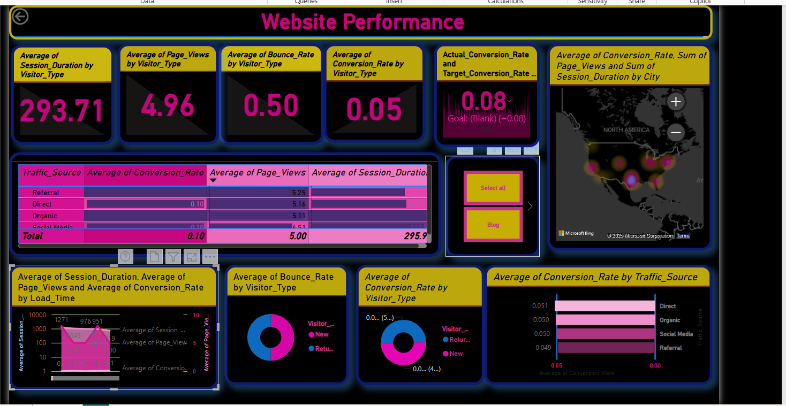

# 🌐 Website Performance Dashboard – Power BI Project

A Power BI dashboard analyzing key website performance metrics such as session duration, bounce rate, conversion rate, and traffic sources.

---

## 📊 Key Metrics Visualized

- ⏱️ Average Session Duration by Visitor Type
- 📄 Average Page Views by Visitor Type
- 🔁 Average Bounce Rate & Conversion Rate by Visitor Type
- 🌍 Geo Heatmap of Traffic & Engagement by City
- 📈 Performance by Traffic Source (Referral, Direct, Organic, Social Media)
- 📉 Comparison of Load Time vs Conversion & Page Views

---

## 📌 Tools Used

- Microsoft Power BI  
- DAX Formulas  
- Custom Visuals and Maps

---

## 📸 Dashboard Screenshot

---

## 📁 Files Included

- `website_performance.pbix`: Power BI file
- `Screenshot`: Dashboard overview in PNG
- `Target_table`: Data source used in visualizations

---

## 🧠 Insights

- 🔺 New visitors had slightly higher bounce rates but similar conversion behavior.
- 🔻 Organic traffic had lowest conversion performance.
- 🌆 Cities with high traffic don’t always show high conversion — optimization needed!

---

👩‍💻 Created by [Urvashi](https://github.com/urvi-code)

